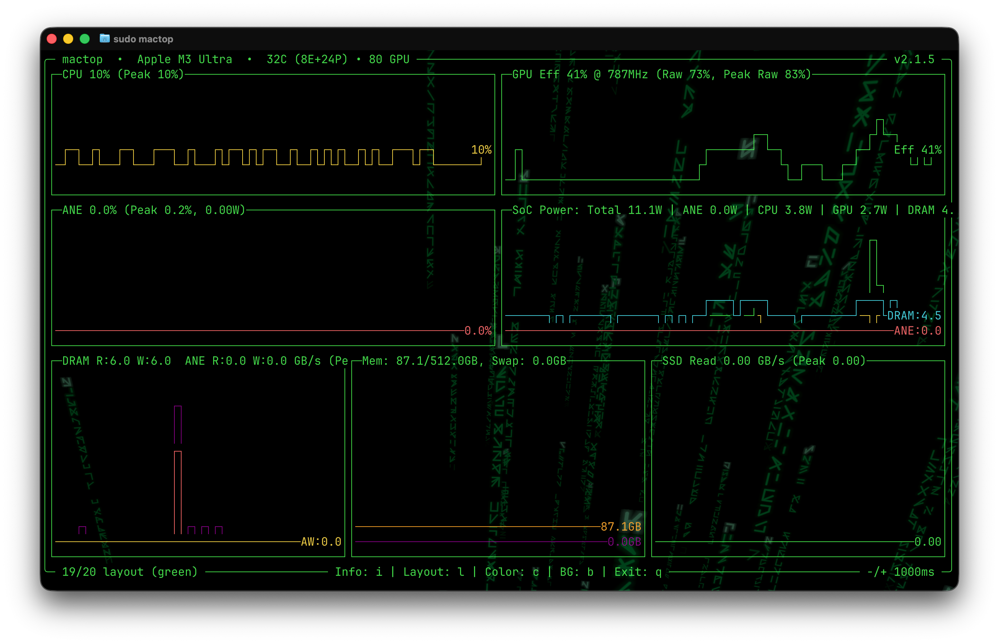
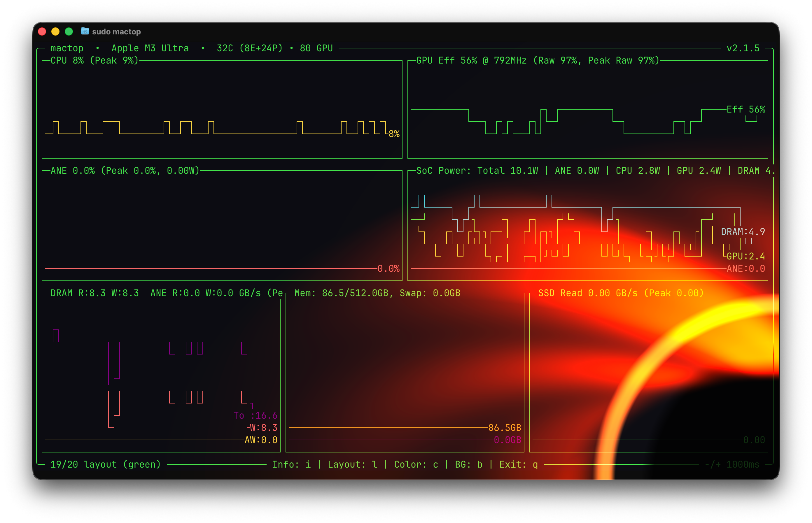
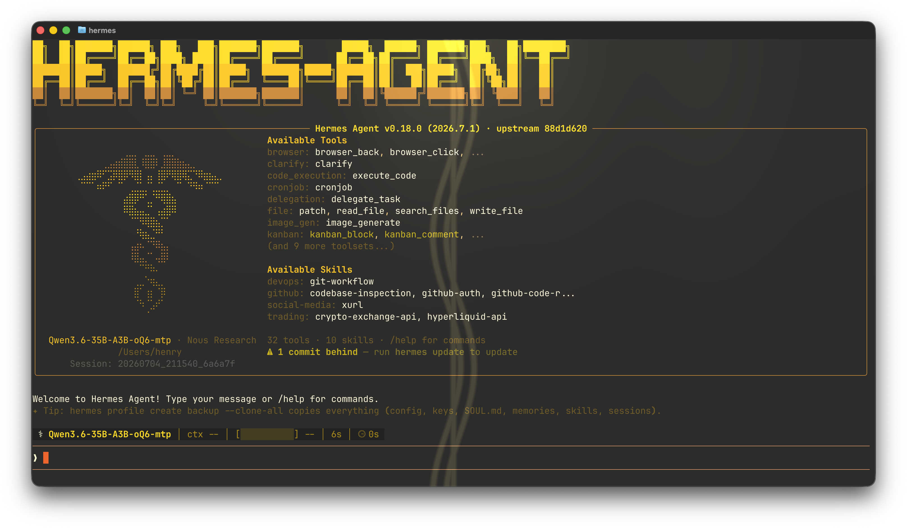

# Ghostty Shaders

A collection of GLSL shaders I use with [Ghostty](https://github.com/ghostty-org/ghostty) for visual effects.

## Shaders

| Shader | Description | Screenshot |
|--------|-------------|------------|
| [inside-the-matrix.glsl](inside-the-matrix.glsl) | The original, unmodified Matrix-style shader. | — |
| [inside-the-matrix-optimized.glsl](inside-the-matrix-optimized.glsl) | Optimized version with reduced GPU usage. |  |
| [gargantua.glsl](gargantua.glsl) | Gargantua-inspired black hole shader. |  |
| [hermes-caduceus.glsl](hermes-caduceus.glsl) | Animated caduceus with heaven light rays and cursor glow. Warm gold tones. |  |

## Installation

Copy your preferred shader file to the Ghostty shaders directory:

```sh
cp <your-choice>.glsl ~/.config/ghostty/shaders/shader.glsl
```

Add the following line to your `~/.config/ghostty/config` file to enable the custom shader:

```ini
custom-shader = ~/.config/ghostty/shaders/shader.glsl
```
